# ME499 Spring 2022 Project
* Ian Kennedy
* Spring 2022

This repository documents the Northwestern ME499 project that I undertook exploring the implementation of a Koopman Operators based approach to model the odometry of differential drive robots. The robot used for this project was a burger-type turtlebot, though the algorithmic principles applied here could be implemented on any differential-drive wheeled robot. 

# Introduction

Koopman operators can be implemented in robotics active learning scenarios for the identification of a system. A Koopman operator model can then be used in tandem with system inputs to propagate state observations through time. A Koopman model in a mathematical sense models a finite dimensional system in infinite dimensions, though it can be approximated, as is done in this paper, using finite dimensional basis functions that are differentiable. Using a data-driven, least squares approach with pseudoinverse operations, these matrices constructed with these basis functions can be used to construct an approximate Koopman model by observing the system inputs and states over time. 

Source: I. Abraham and T. D. Murphey, "Active Learning of Dynamics for Data-Driven Control Using Koopman Operators," in IEEE Transactions on Robotics, vol. 35, no. 5, pp. 1071-1083, Oct. 2019, doi: 10.1109/TRO.2019.2923880.

## Other dependencies

In addition to ROS Noetic and this particular ROS package, several other packages/software repositories are required to run the code present here:
* Gazebo ROS is required to run the cartpole simulations
* The AprilTags repository is required to implement the moving turtlebot modules of the repository. This can be cloned:
\
`git clone https://github.com/AprilRobotics/apriltag_ros.git` 
\
`git clone https://github.com/AprilRobotics/apriltag.git`

* The Realsense camera ROS repository is used for the moving robot modules. This can be installed with instructions from this page: https://github.com/IntelRealSense/realsense-ros#installation-instructions

* Low level control of the turtlebot was accomplished using code developed for a previous course at Northwestern:
`git clone https://github.com/ME495-Navigation/slam-project-ikc8581.git`

To compile the workspace, be sure to run :
`catkin_make_isolated`

## Package contents

The contents of this package are as follows. 

### Supporting Python libraries

There are supporting python library files that were written to abstract the mathematical computation of the Koopman operator from the remainder of the primary ROS node software. They can be found in the src directory.

### Cartpole demos

The early part of the project was spent implementing a Koopman model on a simplem system in order to get acquainted with the approach the algorithm uses. The classic cartpole penduluum system was selected, and implemented in both a control balancing context, and a pure system modeling and propagation through time context. Gazebo was used as a simulator. obot URDF and gazebo files were developed in the urdf folder. In order to run these experiments, the following can be run after cloning this repo into a workspace:

* `roslaunch cartpole cartpole_slide_drive.launch mode:=<mode>`

Mode should be set to "tele" for  system modeling. In order to run the balancing experiment, the pole joint must be set back to a 0 0 0 rpy angle set, and the mode argument should be set to "control"

The remainder of the project was spent implementing the algorithm in the odometry setting on the turtlebot. This part of the project was divided into several parts. 

### Stationary Turtlebot Odometry

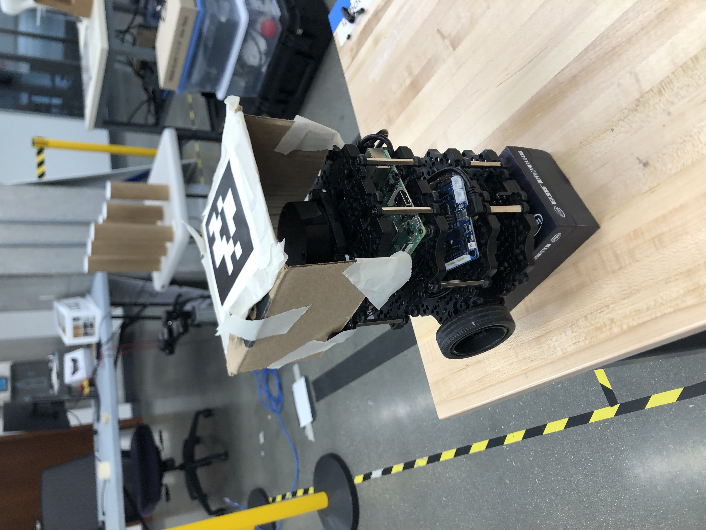

In the first part of the odometry effort, a stationary turtlebot's odometry was computed by elevating the robot's wheels off the ground. In doing so, it was thought that nonlinear dynamics effects such as friction could be eliminated from the system. 
This variant of the algorithm can be run with the following commands.
To launch the turtlebot in a terminal window:
* `nmcli con up eduroam.robot`
* roslaunch nuturtle_control start_robot.launch robot:=name cmd_src:=other

In a separate terminal terminal window:
* `roslaunch cartpole turtle_train.launch mode:=fourier`

Appropriate training times range in the 20s - 30s range.

The scripts folder contains postprocessing scripts used in the plotting of koopman system observable states.

### Moving Turtlebot Odometry

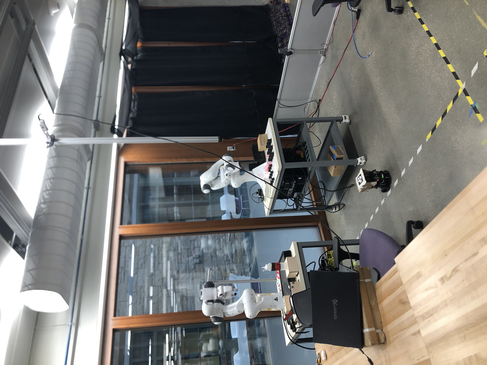
-append video of moving demo

#### 1 Dimensional Turtlebot Odometry Estimation

In order to run the  1 dimensional turtlebot odometry estimation model, 3 terminal are required:
* Start the turtlebot with the same commands as the previous section
* Run the realsense module:
`roslaunch cartpole strait.launch`
* Run the Koopman node:
`rosrun cartpole train_turtle_ground_straight_reverse_theta_in`

#### 2 Dimensional Turtlebot Odometry Estimation

For the two dimensional variant, the same turtlebot setup commands are required.
* Run the realsense module:
`roslaunch cartpole strait_xy.launch`

* Run the turtlebot koopman node:
`rosrun cartpole train_turtle_ground_straight_reverse_theta_in_xy`

# Methods

### Cartpole Koopman Model

For the Gazebo-based Koopman model, the following basis functions were used for estimating the Koopman operator. A least squares data driven approach is implemented to compute the Koopman operator.
`[x xdot theta thetadot sin(theta) cos(theta) 1 u u*cos(theta)]`
\
Gazebo setup:
\
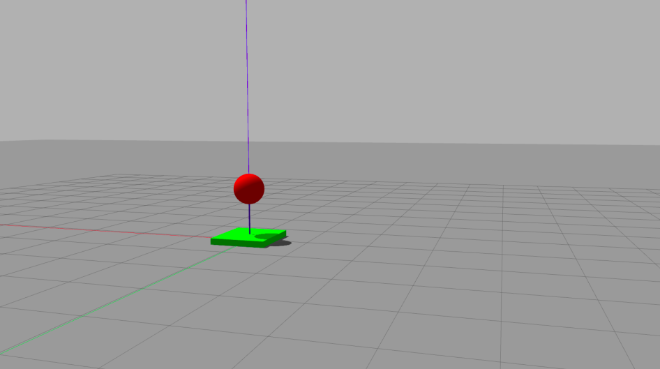

### Stationary Turtlebot 

The turtlebot was mounted on a platform, and the following basis function set was used to compute the Koopman operator:
`[left_wheel_angle right_wheel_angle left_wheel_velocity right_wheel_velocity]`

# Results

-insert plot ofs of propagated cartpole
Position:
\
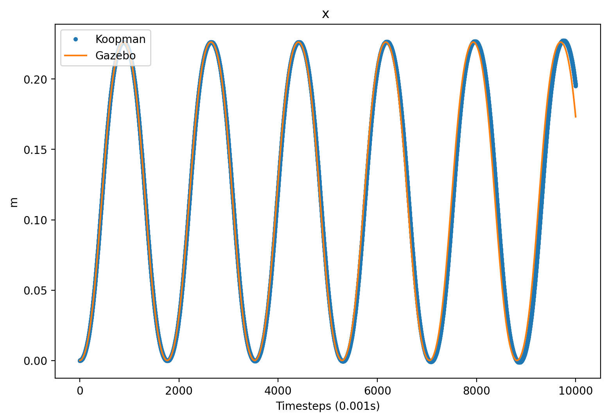

Linear Velocity:
\
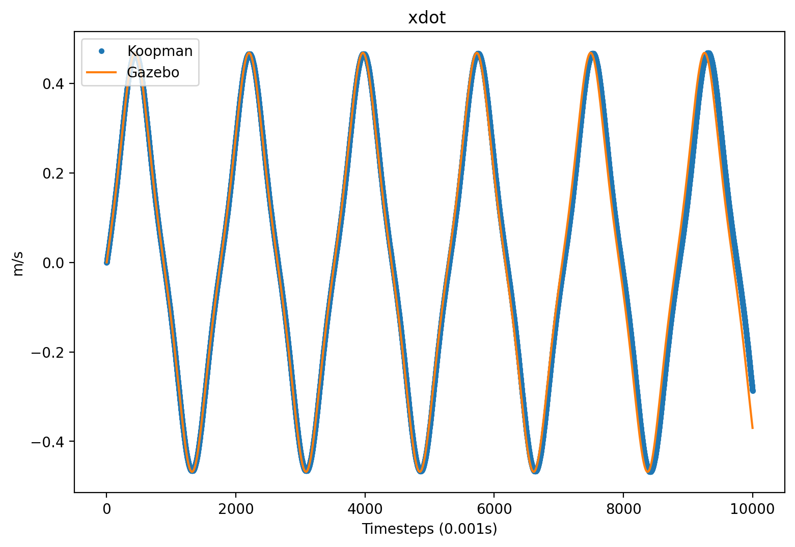

Pole Angle:
\
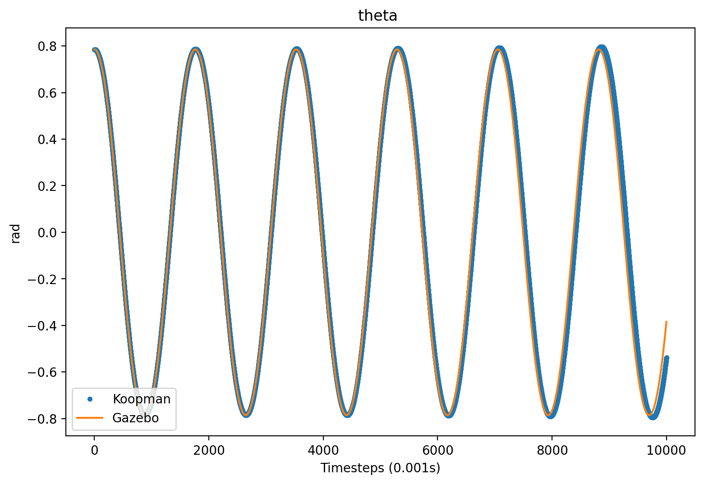

Pole Angular Velocity:
\
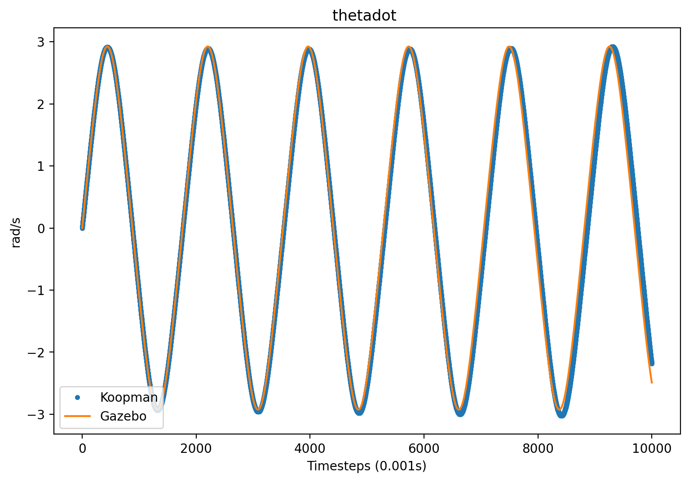

-Stationary turtlebot:
\
Left wheel angle:
\
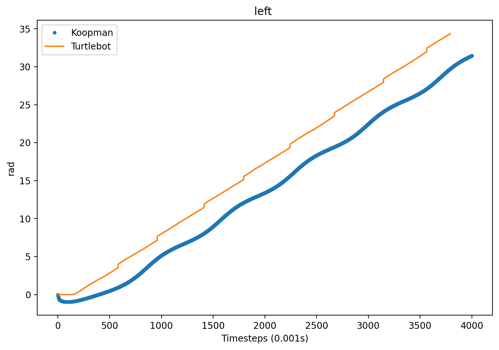

right wheel angle:
\
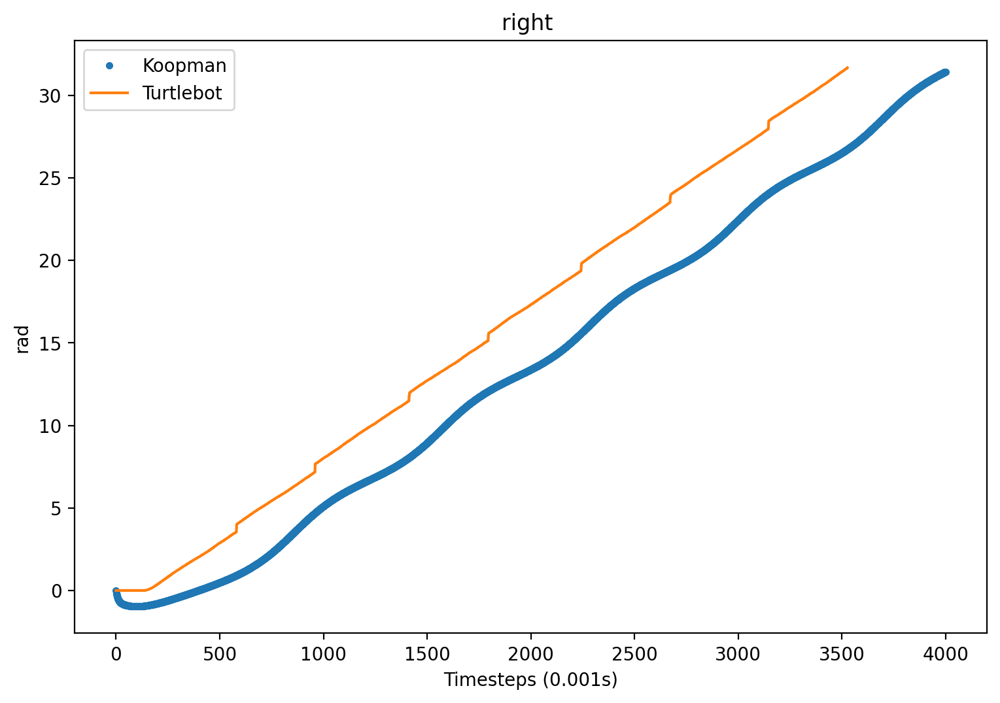

left wheel velocity:
\

Right wheel velocity:
\
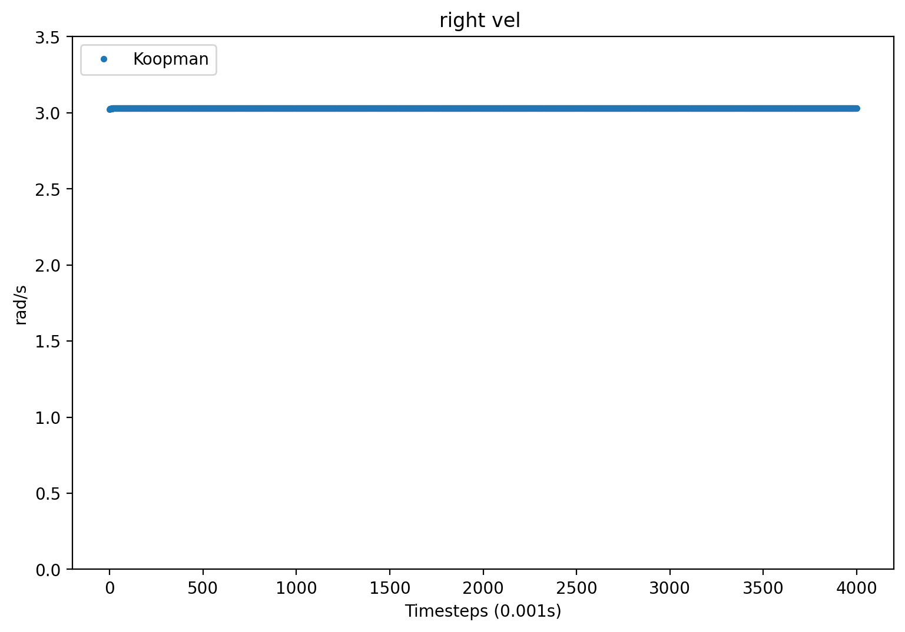

-One dimensional turtlebot odometry:

- X position:
\
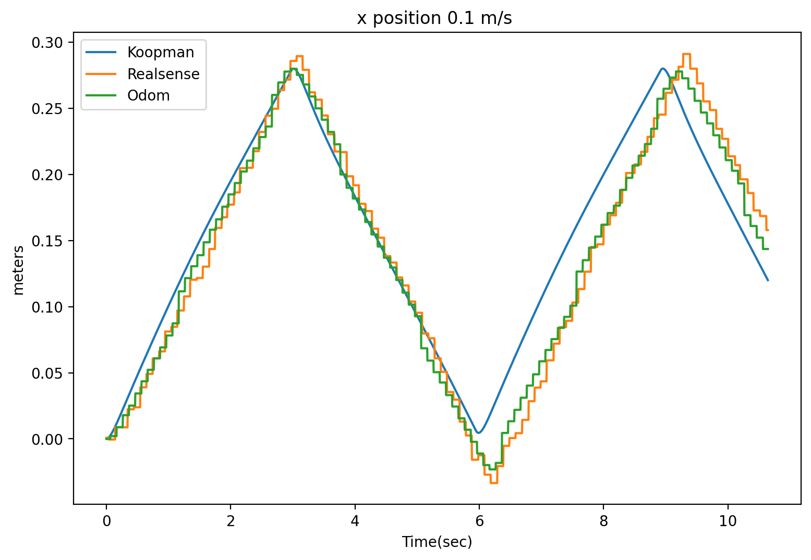
\
In a singular dimension, the turtlebopt was driven forward and in reverse for training. This resulted in the plot attached in this section. It was found that X position could be predicted, though it did not significantly outperform the encoder estimate. 

-Two dimensional turtlebot

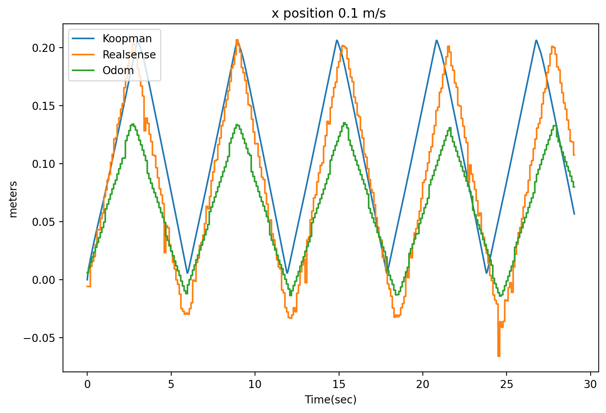
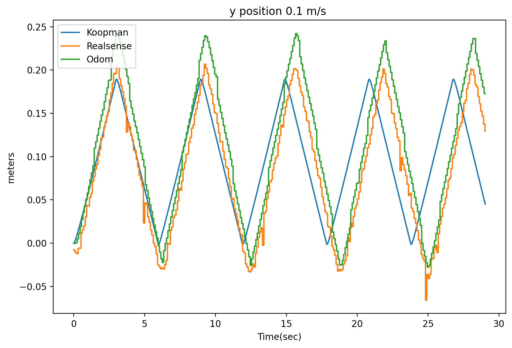

# Conclusion and Next Steps

-higher order polynomials
-debug why states other than position do not perform well